# Getting Started with Aion Labs AI Models on UnitySVC

Aion Labs builds high-performance reasoning models optimized for text generation, coding assistance, and structured reasoning. Through UnitySVC, you can access these models with a single API key — no separate account, no infrastructure to manage, and full usage tracking built in.

This tutorial walks you through the entire process: from getting your API key to chatting with Aion Labs models in your favorite tools.

## Available Models

UnitySVC currently offers three Aion Labs models:

| Model | Model ID | Best For |
|-------|----------|----------|
| **AION 1.0** | `aion-labs/aion-1.0` | Full reasoning model with extended thinking. Complex analysis, code generation, and multi-step problem solving. |
| **AION 1.0 mini** | `aion-labs/aion-1.0-mini` | Compact reasoning model with extended thinking. Faster responses while retaining strong reasoning capabilities. |
| **AION RP LLaMA 3.1** | `aion-labs/aion-rp-llama-3.1-8b` | 8B parameter model built on LLaMA 3.1. Fast, efficient text generation without thinking overhead. |

AION 1.0 and AION 1.0 mini include **extended thinking** — the model reasons through problems before responding. Clients that support this feature will display a "Thought for X seconds" indicator. AION RP LLaMA 3.1 responds directly without a thinking step, making it ideal for quick tasks and high-throughput use cases.

## Prerequisites

Before you begin, you'll need:

1. **A UnitySVC account** — [Sign up at unitysvc.com](https://unitysvc.com) if you don't have one
2. **Enrollment in Aion Labs services** — Navigate to the marketplace and enroll in the Aion Labs models you want to use
3. **An SVCPASS API key** — Generate one from your account dashboard under API Keys

Your API key will look something like: `svcpass_faketestkey1234567890abcdefexample`

## API Endpoint

All Aion Labs models are served from a single OpenAI-compatible endpoint:

```
https://api.unitysvc.com/p/aionlabs
```

This endpoint supports:
- `GET /models` — List available models
- `POST /chat/completions` — Chat completions (streaming and non-streaming)

Because UnitySVC follows the OpenAI API specification, any client or SDK that works with OpenAI can connect to Aion Labs models by changing two settings: the **base URL** and the **API key**.

---

## Quick Start: curl

The fastest way to verify your setup is with curl.

### List Available Models

```bash
curl https://api.unitysvc.com/p/aionlabs/models \
  -H "Authorization: Bearer $SVCPASS_API_KEY"
```

You should see all three Aion Labs models in the response.

### Send a Chat Completion

```bash
curl https://api.unitysvc.com/p/aionlabs/chat/completions \
  -H "Authorization: Bearer $SVCPASS_API_KEY" \
  -H "Content-Type: application/json" \
  -d '{
    "model": "aion-labs/aion-1.0-mini",
    "messages": [{"role": "user", "content": "Explain what a binary search tree is in 3 sentences."}],
    "max_tokens": 500
  }'
```

### Streaming

Add `"stream": true` to receive server-sent events as the model generates:

```bash
curl https://api.unitysvc.com/p/aionlabs/chat/completions \
  -H "Authorization: Bearer $SVCPASS_API_KEY" \
  -H "Content-Type: application/json" \
  -d '{
    "model": "aion-labs/aion-1.0-mini",
    "messages": [{"role": "user", "content": "Write a haiku about programming."}],
    "max_tokens": 200,
    "stream": true
  }'
```

---

## Quick Start: Python (OpenAI SDK)

The official OpenAI Python SDK works out of the box — just point it at the UnitySVC endpoint.

### Install

```bash
pip install openai
```

### Basic Completion

```python
from openai import OpenAI

client = OpenAI(
    base_url="https://api.unitysvc.com/p/aionlabs",
    api_key="svcpass_...",  # Your SVCPASS API key
)

response = client.chat.completions.create(
    model="aion-labs/aion-1.0-mini",
    messages=[{"role": "user", "content": "What is a binary search tree?"}],
    max_tokens=500,
)

print(response.choices[0].message.content)
```

### Streaming Completion

```python
from openai import OpenAI

client = OpenAI(
    base_url="https://api.unitysvc.com/p/aionlabs",
    api_key="svcpass_...",
)

stream = client.chat.completions.create(
    model="aion-labs/aion-1.0",
    messages=[{"role": "user", "content": "Explain recursion with a simple example."}],
    max_tokens=1000,
    stream=True,
)

for chunk in stream:
    if chunk.choices[0].delta.content:
        print(chunk.choices[0].delta.content, end="", flush=True)
print()
```

### Using Environment Variables

For cleaner code, set your credentials as environment variables:

```bash
export OPENAI_BASE_URL=https://api.unitysvc.com/p/aionlabs
export OPENAI_API_KEY=svcpass_...
```

Then your code simplifies to:

```python
from openai import OpenAI

client = OpenAI()  # Reads from environment automatically

response = client.chat.completions.create(
    model="aion-labs/aion-1.0-mini",
    messages=[{"role": "user", "content": "Hello!"}],
)
print(response.choices[0].message.content)
```

---

## Using with Open WebUI

[Open WebUI](https://github.com/open-webui/open-webui) is a self-hosted chat interface that supports any OpenAI-compatible API. It's a great way to interact with Aion Labs models through a familiar ChatGPT-like UI.

### Install

Run Open WebUI with Docker:

```bash
docker run -d -p 3000:8080 --name open-webui ghcr.io/open-webui/open-webui:main
```

Open `http://localhost:3000` and create a local admin account.

### Configure the Connection

1. Click your username in the bottom-left corner and select **Admin Panel**

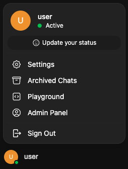

2. Go to **Connections** in the left sidebar

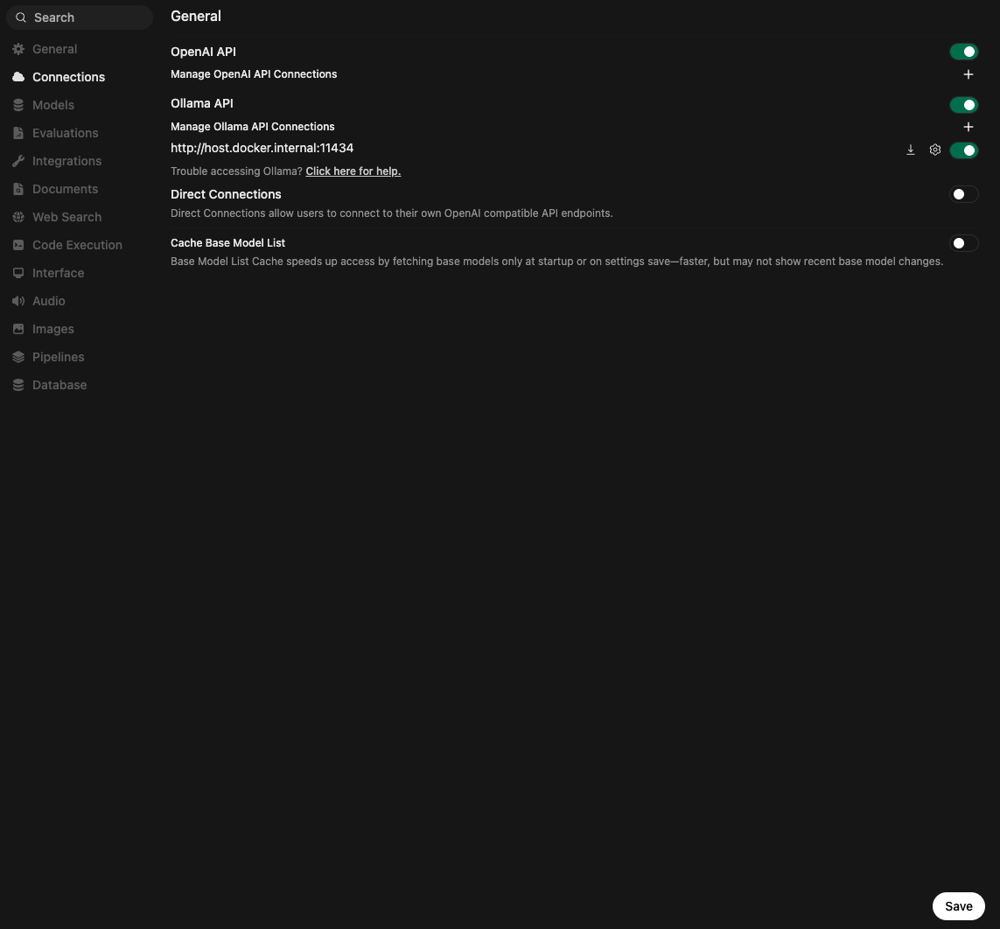

3. Under **OpenAI API**, click the **+** button to add a new connection

4. Fill in the connection details:
   - **URL:** `https://api.unitysvc.com/p/aionlabs`
   - **Auth:** Bearer + your SVCPASS API key
   - Leave **Model IDs** empty to auto-discover all models from the `/models` endpoint

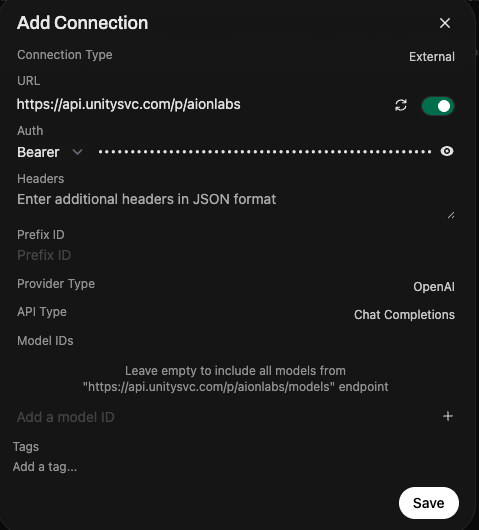

5. Click **Save**. Navigate to **Models** in the sidebar to confirm all three Aion models appear:

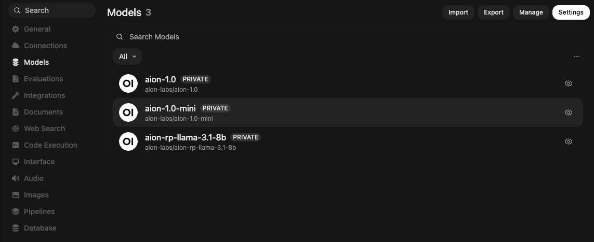

### Chat with Aion Models

Start a new chat and select an Aion model from the dropdown at the top. Here's what each model looks like in action:

**AION 1.0** — Full reasoning model with extended thinking:

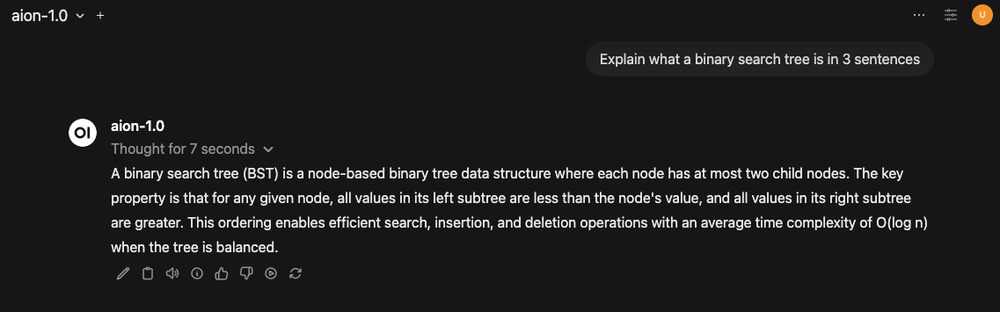

**AION 1.0 mini** — Compact reasoning with faster responses:

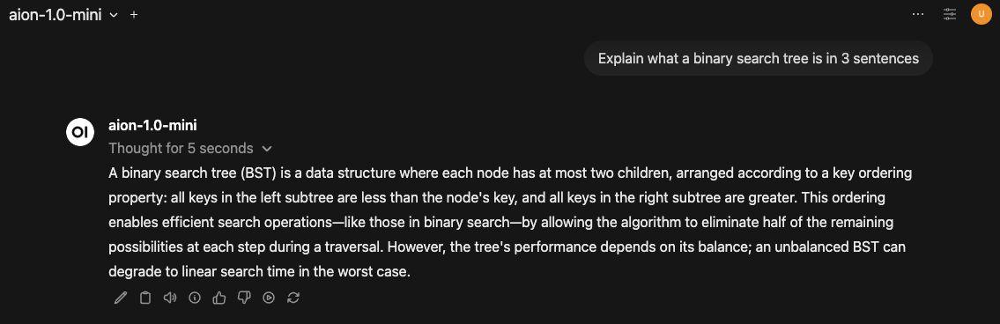

**AION RP LLaMA 3.1** — Direct responses without thinking overhead:

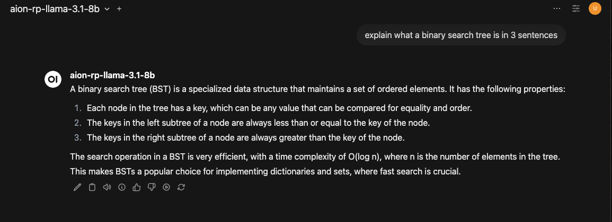

Notice that Open WebUI natively handles the extended thinking feature — displaying "Thought for X seconds" with a collapsible toggle for AION 1.0 and AION 1.0 mini, while AION RP LLaMA responds directly.

---

## Using with Continue (VS Code)

[Continue](https://continue.dev) is an open-source AI code assistant for VS Code. It supports chat, inline editing, and code generation with any OpenAI-compatible model.

### Install

Install the **Continue** extension from the VS Code marketplace.

### Configure

Continue uses a `config.yaml` file located at `~/.continue/config.yaml`. Add the Aion Labs models:

```yaml
name: UnitySVC Aion Labs
version: 0.0.1
schema: v1

models:
  - name: AION 1.0 mini
    provider: openai
    model: aion-labs/aion-1.0-mini
    apiBase: https://api.unitysvc.com/p/aionlabs
    apiKey: svcpass_...
    roles:
      - chat

  - name: AION 1.0
    provider: openai
    model: aion-labs/aion-1.0
    apiBase: https://api.unitysvc.com/p/aionlabs
    apiKey: svcpass_...
    roles:
      - chat

  - name: AION RP LLaMA 3.1
    provider: openai
    model: aion-labs/aion-rp-llama-3.1-8b
    apiBase: https://api.unitysvc.com/p/aionlabs
    apiKey: svcpass_...
    roles:
      - chat
```

> **Note:** The `name`, `version`, and `schema: v1` fields at the top are required. Without them, Continue won't load your models.

After saving, reload VS Code (`Cmd+Shift+P` → "Developer: Reload Window").

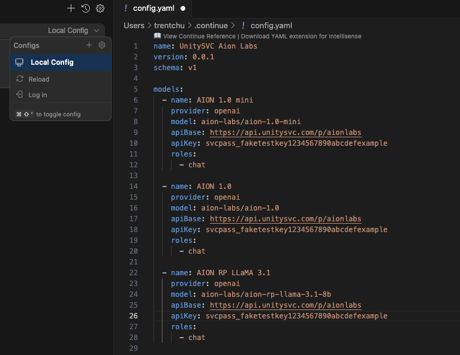

### Use the Models

Open the Continue sidebar (`Cmd+L`) and select an Aion model from the dropdown:

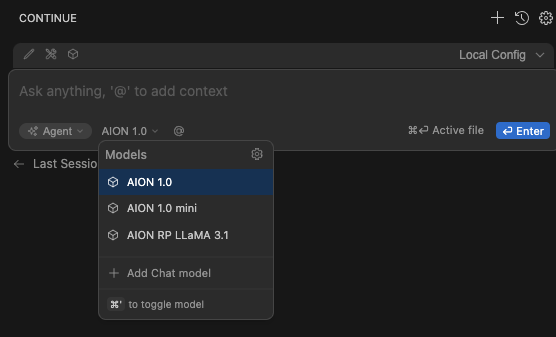

Ask a question and the model streams its response directly in VS Code:

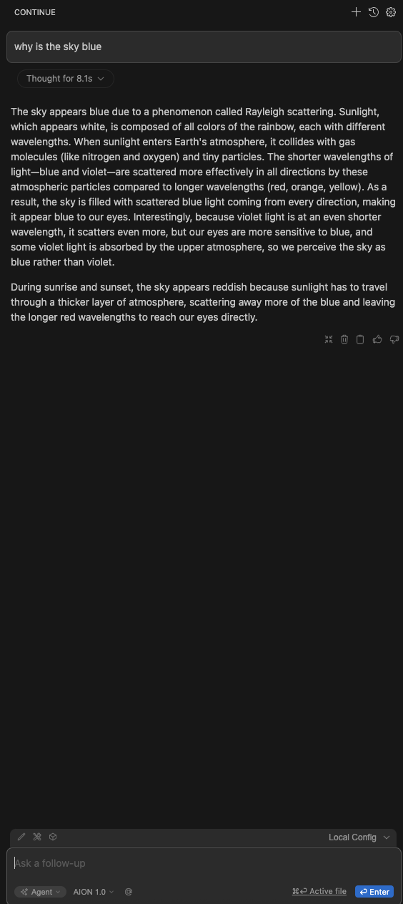

Continue also supports the extended thinking feature, showing "Thought for Xs" for AION 1.0 and AION 1.0 mini:

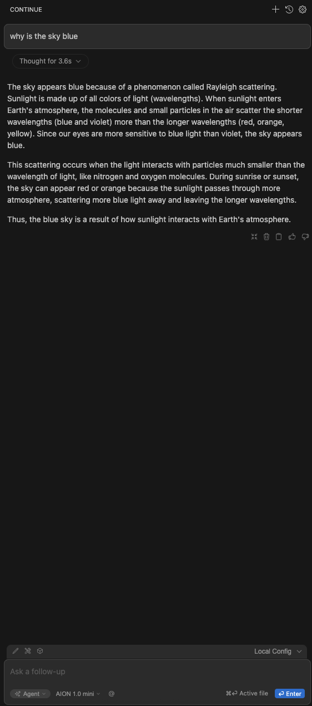

---

## Using with Cline (VS Code)

[Cline](https://github.com/cline/cline) is an autonomous AI coding agent for VS Code that can read files, write code, and execute commands.

### Install

Install the **Cline** extension from the VS Code marketplace.

### Configure

1. Open the Cline sidebar and click the settings gear icon
2. Set **API Provider** to "OpenAI Compatible"
3. Configure:
   - **Base URL:** `https://api.unitysvc.com/p/aionlabs`
   - **API Key:** Your SVCPASS API key
   - **Model ID:** `aion-labs/aion-1.0` (or any of the three models)

<!-- TODO: Add screenshots once Cline integration is verified


-->

### Test

Give Cline a task like "Create a Python function that checks if a number is prime and write tests for it." Cline will use the Aion model to generate code, create files, and optionally run tests — all within VS Code.

---

## Using with Aider

[Aider](https://aider.chat) is a terminal-based AI coding assistant that works with your git repository to make changes and commit them.

### Install

```bash
pip install aider-chat
```

### Configure

Set the UnitySVC endpoint via environment variables:

```bash
export OPENAI_API_BASE=https://api.unitysvc.com/p/aionlabs
export OPENAI_API_KEY=svcpass_...
```

### Run

Navigate to any git repository and launch aider with an Aion model:

```bash
cd your-project
aider --model openai/aion-labs/aion-1.0
```

> **Note:** The `openai/` prefix tells Aider to use the OpenAI-compatible provider. The model ID after the prefix matches the Aion Labs model ID.

Ask Aider to make changes and it will edit your files and create git commits automatically.

<!-- TODO: Add screenshots once Aider integration is verified


-->

---

## Model Comparison

| | AION 1.0 | AION 1.0 mini | AION RP LLaMA 3.1 |
|---|---|---|---|
| **Extended Thinking** | Yes | Yes | No |
| **Thinking Time** | ~7-8 seconds | ~3-5 seconds | Instant |
| **Strength** | Deep reasoning, complex tasks | Fast reasoning, balanced | Quick responses, high throughput |
| **Best For** | Architecture decisions, complex debugging, detailed analysis | General coding, everyday chat, quick reasoning | Simple completions, high-volume tasks, roleplay |
| **Model ID** | `aion-labs/aion-1.0` | `aion-labs/aion-1.0-mini` | `aion-labs/aion-rp-llama-3.1-8b` |

### When to Use Each Model

- **Use AION 1.0** when you need thorough analysis — debugging complex issues, designing systems, or working through multi-step problems where thinking time pays off.
- **Use AION 1.0 mini** as your everyday model — it reasons through problems but responds faster, making it a good default for coding assistance and general chat.
- **Use AION RP LLaMA 3.1** when speed matters more than depth — quick code completions, simple Q&A, or any workflow where you need fast turnaround.

---

## Troubleshooting

### Authentication Errors (401/403)

- Verify your SVCPASS API key is correct and active
- Ensure you're enrolled in the Aion Labs services in the UnitySVC marketplace
- Check that the key is passed as a Bearer token: `Authorization: Bearer svcpass_...`

### Model Not Found (404)

- Use the exact model IDs: `aion-labs/aion-1.0`, `aion-labs/aion-1.0-mini`, or `aion-labs/aion-rp-llama-3.1-8b`
- Hit the `/models` endpoint to confirm which models are available to your account

### Client Can't Connect

- Verify the base URL is `https://api.unitysvc.com/p/aionlabs` (no trailing slash)
- Some clients append `/v1` automatically — if you get 404s, try without the `/v1` suffix in your URL
- Check your network can reach `api.unitysvc.com` (no VPN/firewall blocking)

### Extended Thinking Not Showing

- Extended thinking (`<think>` blocks) is a model feature, not an API feature — it works automatically
- Client support varies: Open WebUI and Continue display "Thought for Xs" natively. Other clients may show the raw `<think>` tags or hide them entirely.

---

## Next Steps

- **Explore other UnitySVC services** — Browse the [marketplace](https://unitysvc.com/marketplace) for more AI models and APIs
- **Check your usage** — Monitor token consumption and costs from your [dashboard](https://unitysvc.com/dashboard)
- **Read the API docs** — Full OpenAI-compatible API reference at [unitysvc.com/docs](https://unitysvc.com/docs)
- **Need help?** — Reach out to support or join the community on Discord
